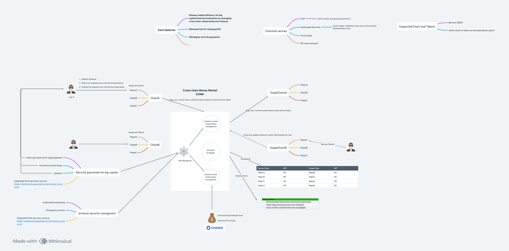

# StratoLend Network

Our capabilities align seamlessly with multi-chain infrastructure, enabling us to deliver advanced, institutional-grade strategies while also offering flexible services tailored to retail participants.

## Protocol introduction

### Background

Lending protocols represent a core category within decentralized finance (DeFi), enabling users to significantly enhance their capital efficiency. Currently, leading protocols such as Compound and Aave primarily implement lending and borrowing functionalities on a single blockchain. However, market demand increasingly points towards solutions that allow users to deposit tokens on a source chain and borrow tokens on a different target chain.

Although several cross-chain lending protocols exist, substantial challenges persist. Pike Finance, for instance, suffered an exploit due to vulnerabilities in its smart contract bridge interactions. Kava Lend, while operational, continues to see relatively low transaction volumes. Radiant Capital, meanwhile, predominantly experiences intra-chain lending activities, with cross-chain borrowing metrics remaining comparatively limited.

Integrating lending functionalities with cross-chain bridging introduces heightened security concerns, as bridges frequently become points of vulnerability. Nevertheless, there is undeniable demand from financial institutions and large capital holders aiming to efficiently manage assets across multiple blockchains. Increased reliance on bridges may amplify security risks, yet the flexibility they provide is essential for maximizing capital efficiency across diverse blockchain ecosystems.

Recognizing these challenges and opportunities, our protocol is specifically designed to support financial institutions and significant capital entities in enhancing their asset management capabilities. By leveraging advanced security mechanisms and sophisticated management tools, we ensure robust protection alongside optimized capital utilization. Additionally, our platform provides flexibility tailored specifically for retail users.

### Features

1. Cross-Chain Lending and Borrowing (Priority 1)

   1. Users can deposit collateral on the source chain and select borrowing tokens on the target chain.
   2. Chains supported: Ethereum, BNB, Avalanche.
      Collateral tokens supported: ETH, BNB.
      Borrowing token supported: USDC.

2. Collateral Management (Priority 1)

   1. Efficient management of user collateral and borrowed capital across different chains.
   2. Consistent maintenance of health factors during deposits and redemptions.
   3. Robust liquidation management system.

3. Security Management

   1. Multi-signature approvals for large deposits.
   2. Partnerships with insurance providers.
   3. Whitelist controls for security.
   4. AI-driven monitoring for proactive security.

4. Optimized Capital Management

   0. AI-driven yield optimization and automated liquidation protection (Priority 1).

   1. Dashboard displaying comprehensive lending and borrowing APYs across different supportede chains
      help user find the potential opportunities or riskes

   2. Build automated yield scanner showing real opportunities
      (TO DO)

   3. Hedge fund-targeted functionalities (TODO, more desgin consideration)
      RESTful APIs for seamless integration
      Webhook notifications for real-time alerts
      Risk management endpoints

   4. Professional capital management tools
      Portfolio rebalancing algorithms
      Automated liquidation protection
      Multi-chain position tracking and analytics

5. Privacy (Priority 1)
   User borrowing activities remain private across chains.
   TODO should check these blow points throughly
   ```
   How would zkp be used for privacy? What is the value-prop for ensuring certain things are private?
   ```

### Stack/Architecture



## Chainlink Services

notices:

1. below should link the related code which applied chainlink services
2. state changed proof in different chains

- [Chainlink Price Feeds](https://docs.chain.link/docs/using-chainlink-reference-contracts)
- [Chainlink VRF V2](https://docs.chain.link/docs/chainlink-vrf)
- [Chainlink Automation](https://docs.chain.link/chainlink-automation/introduction)
- [Chainlink CCIP](https://docs.chain.link/ccip/api-reference/evm/v1.6.0/)

## Instructions

```
forge install smartcontractkit/chainlink@contracts-v0.8.0
forge install smartcontractkit/chainlink-ccip@2114b90f39c82c052e05af7c33d42c1ae98f4180
pnpm add @chainlink/contracts // comptaible for chainlink-ccip@2114b90f39c82c052e05af7c33d42c1ae98f4180
```

## Core Contract Interfaces & ABI

### CollManagement Contract

- **Purpose**: Manages user collateral and initiates cross-chain borrowing requests

#### Main Functions

| Function Name     | Description                   | Parameters                          | Return Value |
| ----------------- | ----------------------------- | ----------------------------------- | ------------ |
| depositCollateral | User deposits collateral      | amount (uint256): amount to deposit | None         |
| userCollateral    | Query user collateral balance | user (address): user address        | uint256      |

#### Events

| Event Name          | Parameters Description                                   |
| ------------------- | -------------------------------------------------------- |
| CollateralDeposited | user (address): user address<br>amount (uint256): amount |

---

### BorrowManagement Contract

- **Purpose**: Executes borrowing on target chain and receives cross-chain loan requests

#### Main Functions

| Function Name | Description                      | Parameters                           | Return Value |
| ------------- | -------------------------------- | ------------------------------------ | ------------ |
| ccipReceive   | Receives cross-chain borrow call | message (bytes): cross-chain message | None         |
| userBorrowed  | Query user's borrowed amount     | user (address): user address         | uint256      |

#### Events

| Event Name     | Parameters Description                                   |
| -------------- | -------------------------------------------------------- |
| BorrowApproved | user (address): user address<br>amount (uint256): amount |

---

### Cross-chain Struct

#### BorrowInfo

| Field               | Type    | Description                                  |
| ------------------- | ------- | -------------------------------------------- |
| user                | address | User address                                 |
| token               | address | Collateral/loan token (supports multi-token) |
| amount              | uint256 | Amount                                       |
| sourceChainSelector | uint64  | Source chain ID                              |
| targetChainSelector | uint64  | Target chain ID                              |

---

### ABI Files

- [CollManagement.abi.json](./abi/CollManagement.abi.json)
- [BorrowManagement.abi.json](./abi/BorrowManagement.abi.json)

**For more detailed usage, please refer to the source code or contact the backend developer.**

## Sponser Services
